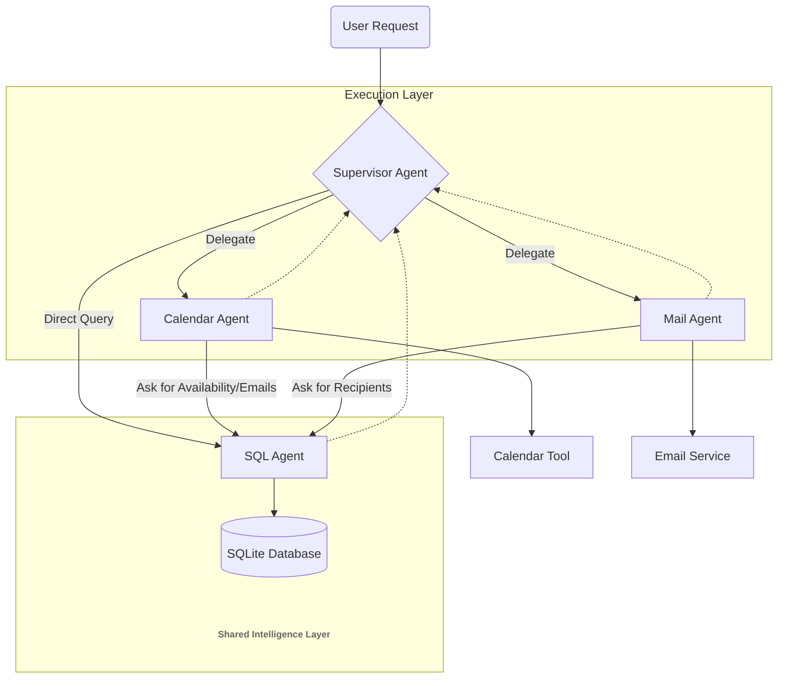

# Hierarchical Multi-Agent Orchestrator 🤖


A production-ready implementation of a **Hierarchical Multi-Agent System** based on the Supervisor-Worker pattern. 
Unlike simple flat structures, this system features a top-level **Supervisor** delegating to sub-agents and a **Shared Intelligence Layer**: specific sub-agents (Calendar, Mail) can autonomously consult the data-retrieval agent (SQL) to resolve dependencies (e.g., retrieving emails) without bothering the Supervisor.

---

## 🚀 Key Features

### 1. Hierarchical & Horizontal Orchestration
The system creates a dynamic workflow:
*   **Supervisor:** Decomposes vague requests and delegates tasks to the appropriate specialist.
*   **SQL Agent (The Shared Brain):** A read-only agent that performs schema introspection to resolve entities (names, teams, availability). It is accessible by **everyone**: the Supervisor, the Calendar Agent, and the Mail Agent.
*   **Calendar/Mail Agents:** Execution workers that can autonomously "phone a friend" (call the SQL Agent) to fill missing parameters before executing their tools.

### 2. Recursive Reasoning Visualization (XAI)
To build trust, the UI implements a custom **Recursive Renderer** that visualizes the entire "Tree of Thought" in real-time. It differentiates between high-level orchestration logs and the nested, internal monologues of sub-agents.

### 3. Multi-Agent FinOps
Standard token tracking fails in multi-agent environments. This project implements a **Custom Usage Handler** that maps token consumption to specific *Agent IDs*, allowing for granular cost attribution (e.g., measuring the cost of data retrieval vs. execution).

### 4. Robust State Persistence & Logging
Supports conversation checkpoints (SQLite/Memory) allowing for context-aware multi-turn conversations.
Integrated with **Redis** and **BetterStack** for external log monitoring.

---

## 🛠️ Architecture

The system follows the **Supervisor-Worker** pattern:

1.  **User Request:** "Schedule a meeting with the Design Team on Monday."
2.  **Supervisor:** Analyzes request -> Decomposes task.
    *   *Step 1:* Asks **SQL Agent** for "Design Team" members and emails.
    *   *Step 2:* Asks **Calendar Agent** to check availability for those emails.
    *   *Step 3:* Instructs **Calendar Agent** to book the slot.
    *   *Step 4:* Instructs **Mail Agent** to send notifications.
3.  **Response:** Final confirmation summary.



---

## 🛠️ Tech Stack

*   **LLM:** Google Gemini 2.5 Flash (via `langchain-google-genai`).
*   **Orchestration:** LangGraph (StateGraph, Supervisor Pattern).
*   **Database:** SQLite (Relational data for Staff/Availability).
*   **Cache:** Redis (Optional, for logging buffer).
*   **App Framework:** Streamlit (with Custom Component rendering).

---

## ⚙️ Engineering Highlights

### Shared Dependency Pattern
A common pitfall in Agentic AI is the "Bottleneck Supervisor", where the boss has to fetch all data before delegating.
In this architecture, the **SQL Agent** acts as a tool available to the Supervisor, but also to the **Calendar** and **Mail** agents.
*   *Example:* If asked to "Email the Engineering Team", the Mail Agent doesn't fail or ask the Supervisor. It autonomously calls the `check_staff_info` tool (SQL Agent) to resolve the "Engineering Team" into a list of email addresses, and then sends the email.

### Natural Language to SQL (NL2SQL)
The SQL Agent creates a secure sandbox where the LLM performs **dynamic schema introspection**. It reads the table structure first, then constructs syntactically correct SQL queries to answer complex questions like joins between `staff` and `availability` tables.

### Recursive UI Rendering
One of the hardest parts of Agentic UI is visualizing nested steps.
```python
# Logic snapshot from app.py
def render_workflow_node(node):
    # Recursively unpacks the LangGraph execution trace
    # differentiating between Supervisor decisions and Worker tool calls
```
This ensures the user sees exactly *why* a sub-agent called another sub-agent.

### Custom Token Tracking
Unlike standard LangChain callbacks, `MultiAgentUsageHandler` (in helpers.py) maps execution runs to specific Agent IDs, allowing for granular cost analysis in a multi-agent environment.

---

## 🧪 Test Scenarios

1.  **The "Autonomous Resolution" Test (Mail -> SQL):**
    > *"Send an email to the Developer Team saying hello."*
    *   *Expected Behavior:* The Mail Agent receives the task, realizes it doesn't have the emails, calls the SQL Agent to get them, and then sends the email. The Supervisor is NOT involved in the data fetching.

2.  **The "Implicit Dependency" Test (Calendar -> SQL):**
    > *"Schedule a meeting with **Marco Rossi** next Friday at 10am."*
    *   *Expected Behavior:* The Supervisor delegates to the Calendar Agent, which then calls the SQL Agent to check Marco's availability before creating the event (in case Marco is available).

3.  **The "Direct Query" Test (Supervisor -> SQL):**
    > *"Find a time when both Marco Rossi and Anna Garau are available on Friday."*
    *   *Expected Behavior:* Since no action is requested, the Supervisor calls the SQL Agent directly to answer the question without involving the Calendar Agent.

3.  **The "Full Orchestration" Test:**
    > *"Schedule a meeting with the Design Team next Monday at 10am and notify them."*
    *   *Expected Behavior:* Supervisor -> Calendar -> SQL (check Availability) -> Calendar (Booking) -> Supervisor -> Mail -> SQL (check Email Addresses) -> Mail (Sending).

---

## 📦 Installation & Usage

### Prerequisites
*   Python 3.11+
*   A Google Cloud API Key (Gemini)

### 1. Clone the repository
```bash
git clone https://github.com/danielecelsa/mail-calendar-assistant.git
cd mail-calendar-assistant
```

### 2. Install dependencies
```bash
pip install -r requirements.txt
```

### 3. Configure Environment
Create a `.env` file in the root directory:
```env
GOOGLE_API_KEY=your_google_api_key
# Optional for logging
REDIS_URL=your_redis_url 
```

### 4. Run the Application
```bash
streamlit run app.py
```

---

<div align="center">
  <b>Developed by Daniele Celsa</b><br>
  <a href="https://danielecelsa.github.io/portfolio/">View Portfolio</a> • 
  <a href="https://www.linkedin.com/in/domenico-daniele-celsa-518b758b/">LinkedIn</a>
</div>