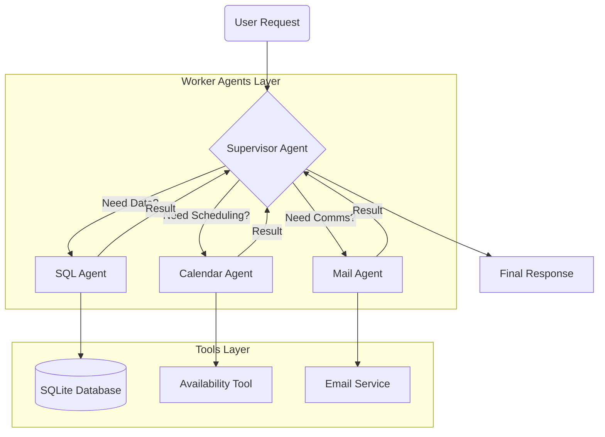

# Hierarchical Multi-Agent Orchestrator 🤖


A production-ready implementation of a **Hierarchical Multi-Agent System** based on the Supervisor-Worker pattern. Unlike flat agentic structures, this system uses a top-level **Supervisor** to intelligently decompose vague human requests into executable actions, routing them to specialized sub-agents (SQL, Calendar, Mail) without context pollution.

---

## 🚀 Key Features

### 1. Hierarchical Orchestration
The system mimics a corporate hierarchy. The **Supervisor Node** maintains the global state and delegates tasks:
*   **SQL Agent:** Safely inspects schemas and executes read-only queries to resolve entities (e.g., "Design Team" -> list of names/emails).
*   **Calendar Agent:** Checks availability and books slots based on logic (e.g., "Find a common free slot").
*   **Mail Agent:** Handles communication and notifications.

### 2. Recursive Reasoning Visualization (XAI)
To build trust, the UI does not just show the answer. It implements a custom **Recursive Renderer** that visualizes the entire "Tree of Thought" in real-time, showing exactly which agent is working, what tools they call, and the raw outputs they receive.

### 3. Multi-Agent FinOps
Standard token tracking fails in multi-agent environments. This project implements a **Custom Usage Handler** that maps token consumption to specific *Agent IDs*, allowing for granular cost attribution (e.g., "How much did the SQL Agent cost vs the Mail Agent?").

### 4. Robust State Persistence & Logging
Supports conversation checkpoints (SQLite/Memory) allowing for context-aware multi-turn conversations.
Integrated with **Redis** and **BetterStack** for external log monitoring.

---

## 🛠️ Architecture

The system follows the **Supervisor-Worker** pattern:

1.  **User Request:** "Schedule a meeting with the Design Team on Monday."
2.  **Supervisor:** Analyzes request -> Decomposes task.
    *   *Step 1:* Asks **SQL Agent** for "Design Team" members and emails.
    *   *Step 2:* Asks **Calendar Agent** to check availability for those emails.
    *   *Step 3:* Instructs **Calendar Agent** to book the slot.
    *   *Step 4:* Instructs **Mail Agent** to send notifications.
3.  **Response:** Final confirmation summary.



---

## 🛠️ Tech Stack

*   **LLM:** Google Gemini 2.5 Flash (via `langchain-google-genai`).
*   **Orchestration:** LangGraph (StateGraph, Supervisor Pattern).
*   **Database:** SQLite (Relational data for Staff/Availability).
*   **Cache:** Redis (Optional, for logging buffer).
*   **App Framework:** Streamlit (with Custom Component rendering).

---

## ⚙️ Engineering Highlights

### Natural Language to SQL (NL2SQL)
The SQL Agent doesn't just run queries; it creates them.
It creates a secure sandbox where the LLM can first `inspect_schema()` to understand the database structure, and then construct syntactically correct SQL queries to answer questions like "Who belongs to the Engineering team?", handling joins and filters autonomously.

### Recursive UI Rendering
One of the hardest parts of Agentic UI is visualizing nested steps.
```python
# Logic snapshot from app.py
def render_workflow_node(node):
    # Recursively unpacks the LangGraph execution trace
    # differentiating between Supervisor decisions and Worker tool calls
```
This ensures the user sees a clean, structured breakdown of the operation, rather than a raw JSON dump.

### Custom Token Tracking
Unlike standard LangChain callbacks, `MultiAgentUsageHandler` (in helpers.py) maps execution runs to specific Agent IDs, allowing for granular cost analysis in a multi-agent environment.

---

## 🧪 Test Scenarios

To validate the **Orchestrator's** logic, try these multi-step prompts:

1.  **The "Entity Resolution" Test (SQL + Calendar):**
    > *"Find a time when both Marco Rossi and the Developer team are available on Friday."*
    *   *Logic:* The Supervisor must first ask SQL Agent to resolve "Developer team" to a list of names, then check intersection of availability and finally pass those info to the Calendar Agent.

2.  **The "Full Workflow" Test (End-to-End):**
    > *"Schedule a meeting with Anna Garau next Monday at 10am and send her an email confirmation."*
    *   *Logic:* Triggers Supervisor -> Calendar -> SQL (check Availability) -> Calendar (Booking) -> Mail (Sending).

---

## 📦 Installation & Usage

### Prerequisites
*   Python 3.11+
*   A Google Cloud API Key (Gemini)

### 1. Clone the repository
```bash
git clone https://github.com/danielecelsa/mail-calendar-assistant.git
cd mail-calendar-assistant
```

### 2. Install dependencies
```bash
pip install -r requirements.txt
```

### 3. Configure Environment
Create a `.env` file in the root directory:
```env
GOOGLE_API_KEY=your_google_api_key
# Optional for logging
REDIS_URL=your_redis_url 
```

### 4. Run the Application
```bash
streamlit run app.py
```

---

<div align="center">
  <b>Developed by Daniele Celsa</b><br>
  <a href="https://danielecelsa.github.io/portfolio/">View Portfolio</a> • 
  <a href="https://www.linkedin.com/in/domenico-daniele-celsa-518b758b/">LinkedIn</a>
</div>